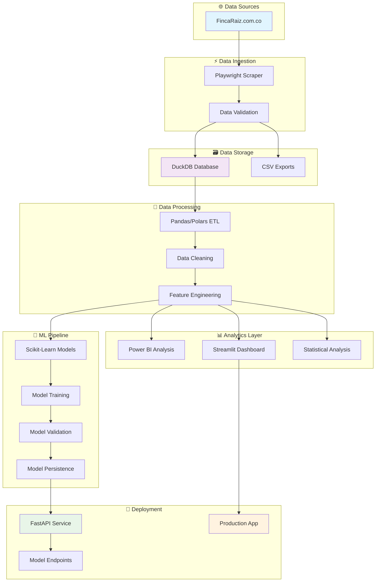
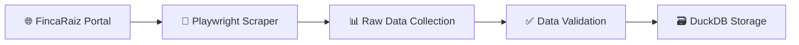
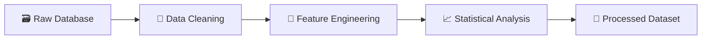
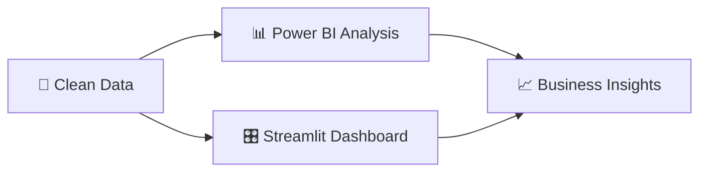
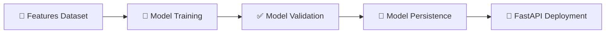

# 🏡 InmoPipeline
### *Pipeline Completo de Análisis del Mercado Inmobiliario Colombiano*

  
  
  

  
  
  
  

## 📋 Tabla de Contenidos

- [📊 Descripción](#-descripción)
- [🏗️ Arquitectura del Proyecto](#️-arquitectura-del-proyecto)
- [🔄 Flujo del Pipeline](#-flujo-del-pipeline)
- [⚙️ Tecnologías Utilizadas](#️-tecnologías-utilizadas)
- [🔮 Roadmap del Proyecto](#-roadmap-del-proyecto)

---

## 📊 Descripción

**InmoPipeline** es un proyecto end-to-end de ingeniería y ciencia de datos que implementa un pipeline completo para el análisis del mercado inmobiliario colombiano. El proyecto integra las tres disciplinas fundamentales del ecosistema de datos moderno:

### 🔧 **Ingeniería de Datos**
- **Web Scraping Automatizado**: Extracción de datos en tiempo real desde FincaRaiz.com.co
- **ETL Pipeline**: Procesos de extracción, transformación y carga optimizados
- **Data Warehousing**: Almacenamiento eficiente con DuckDB

### 📊 **Análisis de Datos**
- **Análisis Exploratorio**: Identificación de patrones y tendencias del mercado
- **Dashboards Interactivos**: Visualizaciones dinámicas con Power BI y Streamlit
- **KPIs del Mercado**: Métricas clave del sector inmobiliario

### 🤖 **Ciencia de Datos**
- **Machine Learning**: Modelos predictivos para estimación de precios
- **Clustering**: Segmentación inteligente de propiedades
- **API de Predicción**: Endpoints REST para consultas en tiempo real

---

## 🏗️ Arquitectura del Proyecto

---

## 🔄 Flujo del Pipeline

### Pipeline Detallado por Fases

#### **Fase 1: 🕷️ Data Extraction**

#### **Fase 2: 🔄 Data Transformation**

#### **Fase 3: 📊 Analytics & Visualization**

#### **Fase 4: 🤖 Machine Learning**

---

## ⚙️ Tecnologías Utilizadas

### 🔧 **Data Engineering Stack**
| Tecnología | Propósito |
|------------|-----------|
|  | Web Scraping Dinámico |
|  | OLAP Database |
|  | Data Manipulation |

### 📊 **Analytics & Visualization**
| Tecnología | Propósito |
|------------|-----------|
|  | Business Intelligence |
|  | Interactive Dashboards |
|  | Advanced Visualizations |

### 🤖 **Machine Learning & Deployment**
| Tecnología | Propósito |
|------------|-----------|
|  | ML Algorithms |
|  | ML API Service |
|  | Model Persistence |

---

## 🔮 Roadmap del Proyecto

- [x] ✅ **v1.0**: Web Scraping y ETL Pipeline
- [x] ✅ **v1.1**: Base de datos DuckDB y exportación CSV
- [ ] 🚧 **v2.0**: Análisis exploratorio completo
- [ ] 📋 **v2.1**: Dashboard interactivo con Streamlit
- [ ] 🤖 **v3.0**: Modelos de Machine Learning
- [ ] 🚀 **v3.1**: API REST con FastAPI
- [ ] 🐳 **v4.0**: Containerización con Docker
- [ ] ☁️ **v4.1**: Deployment en la nube

---
