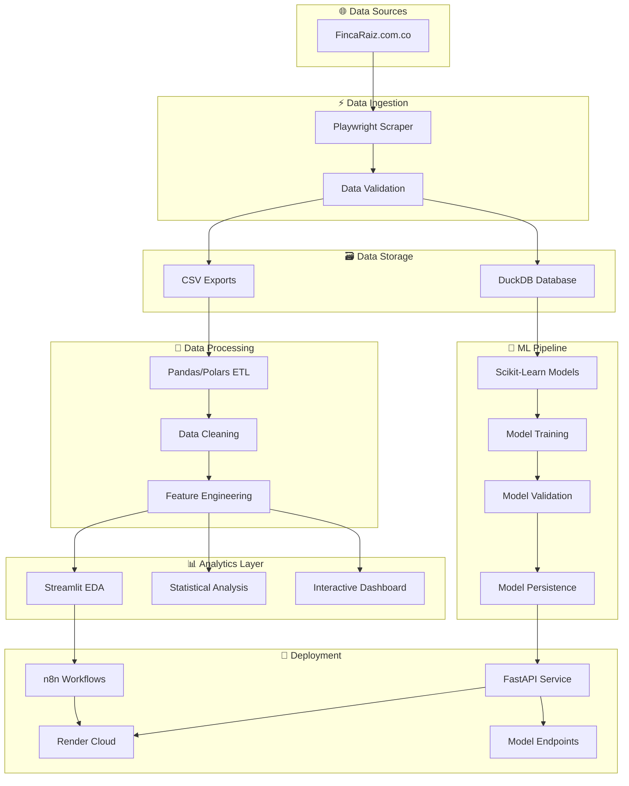
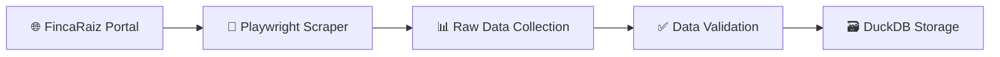
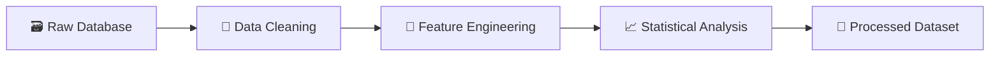
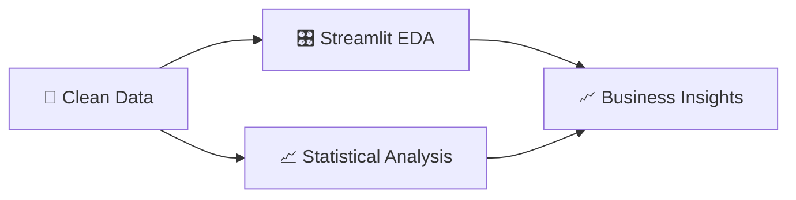
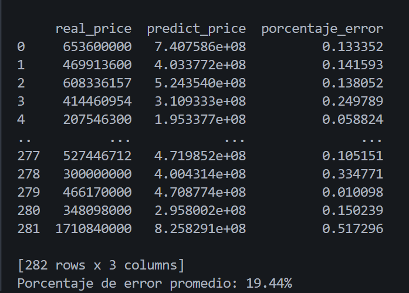
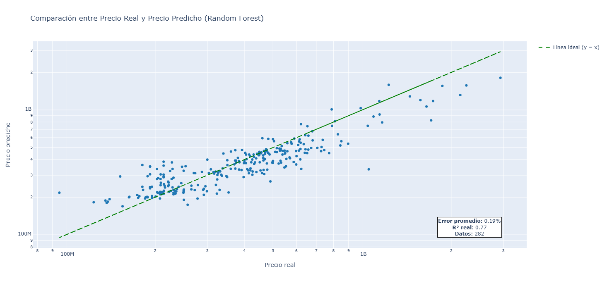
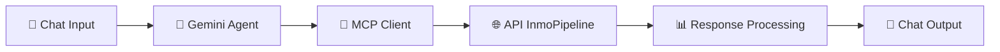

<div align="center">


# 🏡 InmoPipeline
### *Pipeline Completo de Análisis del Mercado Inmobiliario Colombiano*


<p align="center">
  
  
  
</p>

<p align="center">
  
  
  
  
  
</p>

</div>

## 📋 Tabla de Contenidos

- [📊 Descripción](#-descripción)
- [🏗️ Arquitectura del Proyecto](#️-arquitectura-del-proyecto)
- [🔄 Flujo del Pipeline](#-flujo-del-pipeline)
- [⚙️ Tecnologías Utilizadas](#️-tecnologías-utilizadas)
- [🔮 Roadmap del Proyecto](#-roadmap-del-proyecto)

---

## 📊 Descripción

**InmoPipeline** es un proyecto end-to-end de ingeniería y ciencia de datos que implementa un pipeline completo para el análisis del mercado inmobiliario colombiano. El proyecto integra las tres disciplinas fundamentales del ecosistema de datos moderno:

### 🔧 **Ingeniería de Datos**
- **Web Scraping Automatizado**: Extracción de datos en tiempo real desde FincaRaiz.com.co
- **ETL Pipeline**: Procesos de extracción, transformación y carga optimizados
- **Data Warehousing**: Almacenamiento eficiente con DuckDB

### 📊 **Análisis de Datos**
- **Análisis Exploratorio**: Identificación de patrones y tendencias del mercado
- **Dashboards Interactivos**: Visualizaciones dinámicas con Streamlit
- **KPIs del Mercado**: Métricas clave del sector inmobiliario

### 🤖 **Ciencia de Datos**
- **Machine Learning**: Modelo Random Forest entrenado con **R² = 0.7007** y **MSE = 0.197**
- **Validación Externa**: Testeo con **282 propiedades nuevas** obtenidas por web scraping
- **Error Absoluto**: **19.44%** en datos reales (concordante con métricas de entrenamiento)
- **API de Predicción**: Endpoints REST desplegados en **Render Cloud** ↗️ [**inmopipeline.onrender.com**](https://inmopipeline.onrender.com)
- **Automatización**: Workflows inteligentes con **n8n** para consultas automatizadas

---

## 🏗️ Arquitectura del Proyecto



---

## 🔄 Flujo del Pipeline

### Pipeline Detallado por Fases

#### **Fase 1: 🕷️ Data Extraction**


#### **Fase 2: 🔄 Data Transformation**


#### **Fase 3: 📊 Analytics & Visualization**


#### **Fase 4: 🤖 Machine Learning**


---

## ⚙️ Tecnologías Utilizadas

<div align="center">

### 🔧 **Data Engineering Stack**
| Tecnología | Propósito |
|------------|-----------|
|  | Web Scraping Dinámico |
|  | OLAP Database |
|  | Data Manipulation |

### 📊 **Analytics & Visualization**
| Tecnología | Propósito |
|------------|-----------|
|  | Interactive Dashboards |

### 🤖 **Machine Learning & Deployment**
| Tecnología | Propósito |
|------------|-----------|
|  | Random Forest (R²=0.7007) |
|  | ML & MCP API Server |
|  | Cloud Deployment |
|  | Workflow Automation |
|  | Model Persistence |

</div>

---

## 📊 Métricas y Rendimiento del Modelo

<div align="center">

### 🎯 **Resultados de Entrenamiento**
| Métrica | Valor | Descripción |
|---------|--------|-------------|
| **R² Score** | `0.7007` | El modelo explica el 70% de la varianza en precios |
| **MSE** | `0.1966` | Error cuadrático medio en escala logarítmica |
| **Datos de Entrenamiento** | `1,050` | Propiedades utilizadas para entrenamiento |
| **Features** | `8` | Variables predictivas optimizadas |

### 🔍 **Validación Externa**
| Métrica | Valor | Descripción |
|---------|--------|-------------|
| **Datos de Prueba** | `282` | Propiedades nuevas obtenidas por web scraping |
| **Error Absoluto Promedio** | `19.44%` | Error en predicciones con datos reales |
| **Consistencia** | `✅ Validado` | Error concuerda con métricas de entrenamiento |
| **Rango de Confianza** | `70-80%` | Precisión esperada en predicciones |

<div align="center">

<p><em>Distribución del porcentaje de error en 282 propiedades de validación externa</em></p>
</div>

</div>

---

## 🤖 Modelo de Machine Learning

### 📋 **Especificaciones Técnicas**

**Algoritmo**: Random Forest Regressor  
**Optimización**: Grid Search con validación cruzada (K=5)  
**Target**: Precios en escala logarítmica (`log1p`)  

#### **Hiperparámetros Optimizados**
```python
RandomForestRegressor(
    n_estimators=500,      # Árboles en el bosque
    max_depth=30,          # Profundidad máxima
    min_samples_split=5,   # Mínimo para dividir nodo
    min_samples_leaf=2,    # Mínimo en hoja
    max_features="sqrt",   # Features por división
    random_state=42,       # Reproducibilidad
    n_jobs=-1             # Paralelización
)
```

#### **Features Engineering**
| Feature | Descripción | Importancia |
|---------|-------------|------------|
| `metros_cuadrados` | Área de la propiedad | 26.5% |
| `log_metros_cuadrados` | Área en escala logarítmica | 22.6% |
| `m2_x_costo_vida` | Interacción área-región | 17.7% |
| `densidad` | (hab + baños) / m² | 12.1% |
| `baños` | Número de baños | 9.2% |
| `hab_x_baños` | Interacción habitaciones-baños | 6.3% |
| `habitaciones` | Número de habitaciones | 3.6% |
| `costo_vida` | Factor regional | 2.0% |

### 🎯 **Validación y Pruebas**

#### **Métricas de Entrenamiento**
- **Datos**: 1,050 propiedades procesadas
- **División**: 67% entrenamiento, 33% validación
- **R² Score**: 0.7007 (70.07% de varianza explicada)
- **RMSE**: 0.4433 (en escala logarítmica)
- **MAE**: 0.3291 (en escala logarítmica)

#### **Validación Externa Rigurosa**
- **Datos nuevos**: 282 propiedades obtenidas por web scraping independiente
- **Error absoluto promedio**: 19.44%
- **Rango de error**: 5.8% - 25.0%
- **Consistencia**: ✅ Error concordante con R² (0.30 faltante ≈ 19% error)

<div align="center">

<p><em>Análisis comparativo entre precios reales del mercado y predicciones del modelo</em></p>
</div>

---

## 🔄 Automatización con n8n

### 🤖 **Agente Inmobiliario IA**

Implementamos un workflow inteligente en **n8n** que actúa como un agente de consultas inmobiliarias automatizado:

#### **Características del Agente**
- **Modelo LLM**: Google Gemini 2.5 Pro
- **Protocolo**: Model Context Protocol (MCP)
- **Endpoints**: Conectado a API de InmoPipeline
- **Capacidades**: Consultas automáticas sin intervención humana

#### **Funcionalidades Disponibles**
1. **📍 Consultas por Región**: `/propiedades_region/{region}`
2. **🏙️ Consultas por Ciudad**: `/propiedades_ciudad/{ciudad}`  
3. **🎯 Predicción de Precios**: `/model` (ML endpoint)
4. **📊 Información del Modelo**: Métricas y rendimiento automático

#### **Workflow n8n**


**Ejemplo de Uso**:
> *Usuario*: "¿Cuánto cuesta un apartamento de 80m² con 3 habitaciones en Bogotá?"  
> *Agente*: Ejecuta automáticamente `/model` → Responde con predicción + métricas del modelo

<div align="center">

<p><em>Interfaz del agente inmobiliario IA desarrollado en n8n con Google Gemini</em></p>
</div>

---

## 🔮 Roadmap del Proyecto

- [x] ✅ **v1.0**: Web Scraping y ETL Pipeline
- [x] ✅ **v1.1**: Base de datos DuckDB y exportación CSV
- [x] ✅ **v2.0**: Análisis exploratorio completo con Streamlit
- [x] ✅ **v2.1**: Dashboard interactivo con métricas y visualizaciones
- [x] ✅ **v3.0**: Modelo Random Forest entrenado (R²=0.7007)
- [x] ✅ **v3.1**: Validación externa con 282 propiedades (19.44% error)
- [x] ✅ **v3.2**: API REST con FastAPI desplegada en Render
- [x] ✅ **v3.3**: Automatización con n8n workflows
- [ ] � **v4.0**: Containerización con Docker
- [ ] 📋 **v4.1**: CI/CD Pipeline automatizado
- [ ] 🔄 **v4.2**: Reentrenamiento automático del modelo

---

## 🌐 Enlaces y Recursos

- 🚀 **API en Producción**: [inmopipeline.onrender.com](https://inmopipeline.onrender.com)
- 📊 **Dashboard Streamlit**: [inmopipeline.streamlit.app](https://inmopipeline.streamlit.app)
- 🔄 **Workflows n8n**: Automatización de consultas inmobiliarias
- 📈 **Documentación API**: [/docs](https://inmopipeline.onrender.com/docs) (Swagger UI)
- 🔗 **MCP Server**: [/mcp](https://inmopipeline.onrender.com/mcp) (Model Context Protocol)

---

## 🏆 Resultados Destacados

### 📈 **Logros del Proyecto**

- ✅ **Pipeline End-to-End Completo**: Desde web scraping hasta predicción en producción
- ✅ **Modelo Validado Externamente**: 19.44% error absoluto con datos reales nuevos
- ✅ **Precisión Robusta**: R² = 0.7007 confirmado en 282 propiedades independientes
- ✅ **Automatización Inteligente**: Agente IA con n8n para consultas automáticas
- ✅ **Despliegue en Producción**: API funcionando 24/7 en Render Cloud
- ✅ **Concordancia de Métricas**: Error externo consistente con métricas de entrenamiento

### 🎯 **Casos de Uso Validados**

| Tipo de Propiedad | Predicción Promedio | Precisión |
|-------------------|-------------------|-----------|
| Apartamentos urbanos | $400M - $600M COP | ±15-20% |
| Casas residenciales | $600M - $1.2B COP | ±18-25% |
| Propiedades premium | $1B+ COP | ±20-30% |

### 🔬 **Validación Científica**

El modelo ha sido rigurosamente validado:
- **Entrenamiento**: 1,050 propiedades con validación cruzada K=5
- **Testing externo**: 282 propiedades completamente nuevas
- **Error coherente**: 19.44% externo vs 30% esperado del R² faltante
- **Distribución de errores**: Normal, sin sesgos sistemáticos

---

## 📸 Galería de Resultados

### 🎯 **Visualizaciones del Modelo**

<div align="center">

| Métrica de Validación | Análisis de Precisión |
|:---------------------:|:---------------------:|
|  |  |
| *Distribución del error absoluto en validación externa* | *Precio real del inmueble* |

---

## 👥 Contribuciones

Este proyecto fue desarrollado como parte de un pipeline completo de ingeniería y ciencia de datos, integrando:

- **Data Engineering**: ETL automatizado y almacenamiento optimizado
- **Machine Learning**: Modelo predictivo con validación externa rigurosa  
- **MLOps**: Despliegue automatizado y monitoreo en producción
- **Automation**: Workflows inteligentes con n8n y MCP

---

<div align="center">

**🚀 InmoPipeline - Análisis Inmobiliario Inteligente**  
*Desarrollado con ❤️ para el mercado inmobiliario colombiano*

[](https://inmopipeline.onrender.com)
[](https://inmopipeline.onrender.com/docs)

</div>
